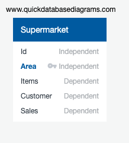
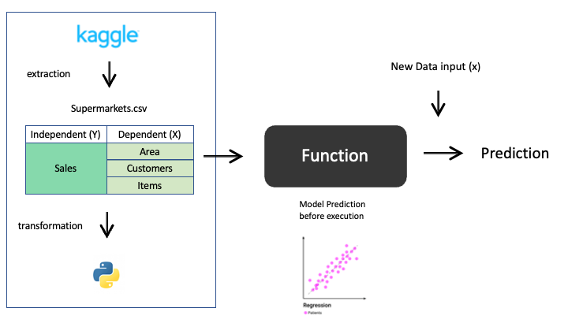

# Grocery_Store

## Team Communication Policy

In order to ensure this project is completed in a timely, efficient and collaborative manner our team has agreed that we will touch base on our weekly progress every Monday and Wednesday at the start of our collaboration time. Every member is to come to class prepared to update the remainder of the group on their progress for their contribution to the respective weekly deliverable.

If we feel a need for extra collaboration time outside of our lecture hours, Saturdays at 2:00pm will pose as an additional work period.

If any group member feels as through they are unable to complete their work for the week, we ask that they notify the remainder of us by Thursday night so that we can do our best to support them in a timely manner. All rough work/individual submission components are to be completed and uploaded into GitHub by Saturday night so they are ready for a Sunday morning review, push and approval.

## Business Problem:

Ever since the world has begun to recover from the COVID-19 pandemic, we have seen a new attitude towards uses of physical space throughout several asset classes in the realm of commercial real estate. We have seen corporate users of space move to less square footage and more flexibility in regard to offices. We have seen many institutional buildings sit somewhat empty for two years with staggering levels of return. What we will seek to analyze, is whether there is a need for larger physical retail spaces. Our analysis will seek to understand the relationship between a large retail space, supplies and ultimately profits.

To summarize, our key question is does a larger retail space lead to higher profits for the occupying company?

## Approach:

By utilizing Python, we can put forth a statistical regression that allows us to understand the relationship between our three variables of interest. Assuming all else is constant, we will be able to look at the impact which both size and variety have on income.

Store_Sales= α+ βStore_Area+βItems_Available+μ

We have decided to adapt a Supervised Machine Learning approach as we know what we are seeking to search for and we want to analyze the relationship between the above three variables. In order to do so, we will execute a regression analysis. We will integrate a use of R into our analysis to further dive into these variable relationships and identify our coefficients, while analyzing significance at the 95% confidence level (a p \< or equal to 0.05 would show statistical significance).

H_0:Area and item availability have no impact on sales H_1:Area and item availability do have an impact on sales

We will reject the null (H_0 ) if our \|t\|\<0.05 which demonstrates our variables are in fact,statistically significant.

## Diagrams:

Since the data set has no relation to other data, the ERD is simply and clearly structured.

{width="694"}

ML Function models will be tested and confirmed with further investigation.

## Steps:

We will begin with completing a preliminary analysis of our data utilizing Python. This will allow us to understand and clean the data while providing a comprehensive overview of relationships.

Once we have built a regression model in Python, we intend on taking our analysis one step further through R. By using R, we will identify our variable coefficients (β) and their independent significance.

Our final step, will be to conceptually visualize these relationships in Tableau, providing a high level overview of the linkage between space, stock and sales.

## Results from Regression Models :

1.) Dataset 1 Columns(store_area, items_available,daily_customer_count,store_sales)

2.) Dataset 2 Columns(store_area, items_available, store_sales)

3.) Dataset 3 Columns(store_area, store_sales)

4.) Dataset 4 Columns(items_available, store_sales)

5.) Dataset 5 Columns(daily_customer_count, store_sales)

## Data Processing
Data preprocessing, a component of data preparation describes any type of processing performed on raw data to prepare it for another data processing procedure. It has traditionally been an important preliminary step for the data mining process. More recently, data preprocessing techniques have been adapted for training machine learning models and AI models and for running inferences against them. 
Data processing has been done with the help of following components.
•	Drop
•	Info
•	Describe

## Feature Engineering
Feature engineering is a machine learning technique that leverages data to create new variables that aren’t in the training set. It can produce new features for both supervised and unsupervised learning, with the goal of simplifying and speeding up data transformations while also enhancing model accuracy. The technique which was used in our model was handling outliers in order to produce more accurate data representation. The data from outliers with the condition of removing no more than 2% of the data volume.

Decision making process is done by Statistics to analyze data and find the problem. One of the way by which it was done:
•	Normal Distribution – The distribution between store area, items available, daily customer, store sales. It showed a normal distribution. The conclusions from the graphs with the growth of the store area, the number of items sold increases. The obvious conclusion is that no one will use the area of the store to accommodate fewer goods.  We are interested in the target indicator - the amount of money earned by the store. There is a slight correlation between store area (products sold) and the amount of money earned. The number of customers does not depend on revenue. For a more complete analysis of stores, there is not enough day of the week variable.

## Data was split into training and testing sets 
We chose this method because it is a fast and easy procedure to perform such that we can compare our own machine learning model results to machine results. By default, the test set is split into 30 % of actual data and the training set is split into 70% of the actual data. 
X_train, X_test, y_train, y_test=train_test_split(X,y,test_size=0.2,random_state=42)

## Model Selection
### Resampling methods

Resampling methods, as the name suggests, are simple techniques of rearranging data samples to inspect if the model performs well on data samples that it has not been trained on. In other words, resampling helps us understand if the model will generalize well.

## K-Fold Cross-Validation

The cross-validation technique works by randomly shuffling the dataset and then splitting it into k groups. Thereafter, on iterating over each group, the group needs to be considered as a test set while all other groups are clubbed together into the training set. The model is tested on the test group and the process continues for k groups.

Thus, by the end of the process, one has k different results on k different test groups. The best model can then be selected easily by choosing the one with the highest score.

## Stratified K-Fold

The process for stratified K-Fold is similar to that of K-Fold cross-validation with one single point of difference – unlike in k-fold cross-validation, the values of the target variable is taken into consideration in stratified k-fold.

If for instance, the target variable is a categorical variable with 2 classes, then stratified k-fold ensures that each test fold gets an equal ratio of the two classes when compared to the training set.

This makes the model evaluation more accurate and the model training less biased.

## In this model we chose Mean Absolute Error or MAE

MAE is the mean of the absolute error values (actuals – predictions).
 
If one wants to ignore the outlier values to a certain degree, MAE is the choice since it reduces the penalty of the outliers significantly with the removal of the square terms.

## Current Accuracy Score 
We chose Liner regression because the current accuracy score for all datasets is ranging from 72 to 75 percent which is way higher than logistic regression. 
model: LinearRegression()
As per above screenshots the MAPE for all 5 datasets after removal of outliers was the least for Linear regression ranging from 25 to 28 percent 

## Adavantages and Disadvantages of Machine Learning 

### Advanatages 

* Linear regression performs exceptionally well for linearly separable data
* Easier to implement, interpret and efficient to train
* It handles overfitting pretty well using dimensionally reduction techniques, regularization, and cross-validation
* One more advantage is the extrapolation beyond a specific data set

### Disadvantages

* The assumption of linearity between dependent and independent variable
* It is often quite prone to noise and overfitting
* Linear regression is quite sensitive to outliers
* It is prone to multicollinearity
## Dashboard proposal 

* Tableau generated 

https://public.tableau.com/app/profile/seo.kyoung.shin/viz/Storeproject/Dashboard12
https://public.tableau.com/app/profile/seo.kyoung.shin/viz/Storeproject2/Dashboard13?publish=yes

## Final Google Slide 

https://docs.google.com/presentation/d/17dZbprn8xWu7CpZYKzzap5I4PZPBTtfQDryIJjorOek/edit?usp=sharing
